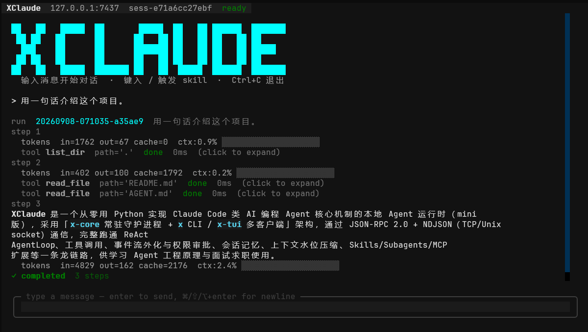
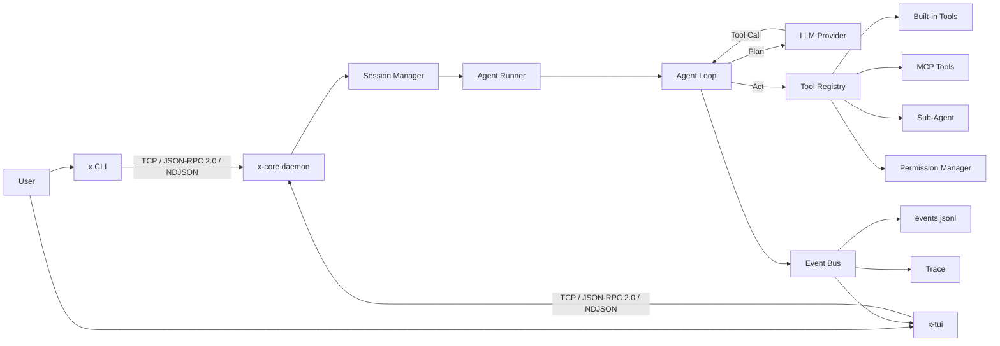

# XClaude

<div align="center">


### Local AI Agent Runtime

**让 Agent 从“调用大模型”走向可执行、可审批、可恢复、可追踪的本地运行时。**

<p>
  
  
  
  
  
  
  
  
</p>


[核心能力](#-核心能力) ·
[系统架构](#-系统架构) ·
[执行链路](#-执行链路) ·
[界面预览](#-界面预览) ·
[快速开始](#-快速开始) ·
[使用方式](#-使用方式) ·
[项目结构](#-项目结构)

</div>

---

## 项目简介

XClaude 是一个面向**本地开发工作流**的 AI Agent Runtime。

用户通过 CLI 或 TUI 提交任务后，`x-core` 作为常驻 daemon 统一承载会话管理、Agent Loop、LLM 调用、工具执行、权限审批、Sub-Agent、MCP、事件持久化与 Trace；客户端通过 TCP 上的 JSON-RPC 2.0 + NDJSON 与 Core 通信，并实时接收 Agent 的执行过程。

> **核心目标：不是把 Agent 做成一个简单的聊天 CLI，而是把一次 Agent 执行组织成有状态、有权限边界、可恢复、可观测、可扩展的本地运行时。**

---

## 🖥 界面预览

<p align="center">
  
</p>


XClaude 提供基于 Textual 的终端交互界面，可实时展示 LLM 流式输出、工具调用、执行耗时、权限审批、Sub-Agent 进度与上下文使用情况。

---

## ✨ 核心能力

| 能力               | 说明                                                         |
| ------------------ | ------------------------------------------------------------ |
| **Daemon Runtime** | `x-core` 常驻运行，CLI / TUI 作为独立客户端接入              |
| **Agent Loop**     | 基于 `Plan → Act → Observe` 驱动多 Step Agent 执行           |
| **Tool Calling**   | 统一 `ToolRegistry` 管理内置工具、Sub-Agent 工具与 MCP 工具  |
| **Permission**     | 对 `bash`、`write_file` 等敏感操作进行运行时审批             |
| **Session**        | 支持多轮会话、Continue / Resume、历史消息持久化              |
| **Skills**         | 支持内建、用户级、项目级 Skill 与 `/` 自动补全               |
| **Sub-Agent**      | 支持 Planner / Executor / Reviewer 等角色化子 Agent 与后台并行执行 |
| **MCP**            | 支持通过 `stdio` / `tcp` 接入外部 MCP Server                 |
| **Compaction**     | 支持长上下文压缩与 Tool Result 截断                          |
| **Trace**          | 记录 IPC、Event、LLM 等执行链路，支持按 Run 查询与回放       |

---

## 🏗 系统架构



系统采用**双进程架构**：

```text
x / x-tui
    │
    │ TCP + JSON-RPC 2.0 + NDJSON
    ▼
x-core
    │
    ├── Session Manager
    ├── Agent Runner
    ├── Agent Loop
    ├── Tool Registry
    ├── Permission Manager
    ├── Sub-Agent
    ├── MCP
    └── Event / Trace
```

`x-core` 负责真正的 Agent Runtime；CLI 更适合调试与脚本化调用，TUI 负责主要交互与执行过程展示。

---

## 🔄 执行链路

一次典型 Agent Run：

```text
User Goal
   ↓
CLI / TUI
   ↓
x-core
   ↓
SessionManager
   ↓
AgentRunner
   ↓
AgentLoop
   │
   ├── Plan
   │    └── 调用 LLM
   │
   ├── Act
   │    └── 执行 Tool / MCP / Sub-Agent
   │
   └── Observe
        └── Tool Result 写回上下文
   ↓
下一 Step
   ↓
end_turn / max_steps
   ↓
Final Answer
```

Agent Loop 会持续执行：

```text
Plan → Act → Observe → Plan → ...
```

直到模型返回最终答案，或达到最大 Step 限制。

---

## 🧰 内置工具

XClaude 通过统一的 `ToolRegistry` 向 Agent 暴露工具。

| Tool           | 用途                         |
| -------------- | ---------------------------- |
| `read_file`    | 读取文件                     |
| `list_dir`     | 浏览目录                     |
| `write_file`   | 写入文件                     |
| `bash`         | 执行 Shell 命令              |
| `task_create`  | 创建任务                     |
| `task_update`  | 更新任务                     |
| `task_list`    | 查看任务列表                 |
| `task_get`     | 获取任务详情                 |
| `note_save`    | 将信息写入当前 Session Notes |
| `spawn_agent`  | 派生隔离上下文的 Sub-Agent   |
| `agent_result` | 获取后台 Sub-Agent 执行结果  |

配置 MCP Server 后，外部 MCP Tools 也会注册到同一个 Tool Registry。

---

## 🔐 权限控制

XClaude 在工具真正执行前增加 Permission 层，对敏感操作进行审批。

默认策略：

| Tool         | 默认策略 |
| ------------ | -------- |
| `read_file`  | Allow    |
| `list_dir`   | Allow    |
| `note_save`  | Allow    |
| `write_file` | Ask      |
| `bash`       | Ask      |
| 未知工具     | Ask      |

当 `bash` 命令检测到当前工作目录之外的路径访问时，会强制进入审批流程。

`read_file`、`list_dir`、`write_file` 的实际路径必须位于 daemon 启动的项目目录内；
项目内绝对路径可用，项目外绝对路径、父级遍历以及指向外部的符号链接/Windows 联接会被拒绝。
这不是操作系统沙箱：批准的 Shell 和 MCP 工具仍能按当前系统账户权限执行操作。

`write_file` 使用临时文件原子替换，失败时保留原文件。覆盖已有文件前必须在当前任务中
用 `read_file` 完整读取（截断读取不授权覆盖）。每个 Agent 独立记录文件版本并随检查点保存；
若文件已被其他任务修改或抢先创建，返回 `file_conflict`，不自动重试，模型应重新读取并合并修改。
此保护针对同一 daemon 的内建文件工具，不是外部编辑器、Shell/MCP 或多 daemon 的跨进程事务。

TUI 重连会回放当前会话的主/子任务事件，按 `event_id` 去重，并同步实际运行状态。
工具块使用 `(run_id, tool_use_id)` 匹配结果，流式回复按运行隔离；历史审批不会重新变成可操作弹窗。
daemon 对会话存储目录持有操作系统文件锁，即使换端口也不能同时写同一目录。
正常退出、启动失败或进程被终止后锁会释放；保留的 `.daemon.lock` 文件不表示锁仍被占用，不要删除它。

IPC 只允许回环地址。daemon 自动在 `~/.x/ipc/` 生成私有凭据，TUI/CLI 重连时自动读取；
无凭据客户端不能调用命令或订阅事件。凭据采用 Windows 当前用户专属 ACL / POSIX 0600 权限。
审批回复必须匹配会话、run_id 和工具 ID，且来自收到该实时审批的对应订阅连接；
全局观察连接不能审批。此认证不隔离同一系统账户下能够读取凭据的程序，也不是多用户授权系统。

TUI 中支持：

```text
Allow once
Always allow
Deny
Always deny
```

持久化策略保存在：

```text
~/.x/policy.toml
```

---

## 🧩 Skills

XClaude 支持 Markdown 形式的 Skill，将固定任务模板、工具边界与 Agent 行为封装成可复用能力。

Skill 查找优先级：

```text
项目级 .x/skills
      ↓
用户级 ~/.x/skills
      ↓
Built-in Skills
```

支持：

```text
.x/skills/example.md
```

以及：

```text
.x/skills/example/SKILL.md
```

一个 Skill 可以定义：

```markdown
---
name: inspect
description: 分析当前项目结构
allowed_tools:
  - read_file
  - list_dir
---

请分析当前项目，并完成：

$ARGUMENTS
```

TUI 中可直接输入：

```text
/inspect 分析 src 目录
```

当前内建 Skills：

```text
/init
/orchestrate
/review
/summarize
```

TUI 同时提供：

```text
/clear
/compact
/recover
/exit
```

其中 `/init` 可以自动分析当前项目并生成：

```text
.x/context.md
```

---

## 🤖 Sub-Agent

XClaude 支持通过 `spawn_agent` 派生独立子 Agent。

```text
Root Agent
├── Planner
├── Executor
└── Reviewer
```

Sub-Agent 具备以下特性：

- 使用独立冷启动上下文；
- 不自动继承父 Agent 的完整对话历史；
- 可通过 Agent Profile 约束角色与允许工具；
- 支持前台同步执行；
- 支持后台并行执行；
- 后台任务可通过 `agent_result` 获取结果；
- 后台任务保存原子检查点，恢复原会话后可从安全步骤边界续跑，并重新查询已完成结果；
- 支持有限层级的嵌套 Sub-Agent。

daemon 重启后，在原项目目录执行 `uv run x-tui --continue` 或
`uv run x-tui --resume <SESSION_ID>`；保持打开的 TUI 断线重连也会恢复当前会话。
恢复在会话订阅建立后触发，不会在 daemon 启动时擅自执行所有历史会话。
`/clear`、`/exit` 和显式关闭会话仍会取消未完成任务，取消的任务不会自动续跑。

在 TUI 输入 `/recover` 查看主任务及后台任务、完整 run_id 及待核对工具。恢复初始化失败后，
修正问题再执行该命令即可重试，无需重启 daemon。
工具执行中断仍不会自动重放；核对每项操作后，提交实际结果：

```text
/recover <RUN_ID> {"tool_use_id":"已经核对的实际结果"}
/recover <RUN_ID> {"tool_use_id":{"content":"确认未执行或执行失败的原因","is_error":true}}
```

工具结果逐项写入检查点；只需提交 `pending_tools` 中尚未确认的调用 ID，已确认的调用
不会重放。不可遗漏或猜测。模型、服务地址、窗口或
MCP/工具契约变化会阻止自动续跑，核对后可在 JSON 前添加 `--accept-config`。
旧检查点未记录配置指纹时也需确认。主 Agent 的 chat 任务及后台子 Agent 都可从安全
检查点跨 daemon 重启续跑，保留原 run_id、消息、记忆与步数。
已生成回答但历史提交中断时只重试提交，不重复推理或追加回答。
尚未确认的外部工具副作用仍不提供 exactly-once 保证，恢复会暂停等待核对。

检查点位于 `~/.x/sessions/<SESSION_ID>/runs/<RUN_ID>/`：
主任务使用 `root.json`，后台子任务使用 `background.json`。
若中断发生在工具执行期间，结果可能尚未确认，任务会提示“需要核对”，
不会自动重放 Shell、写文件或 MCP 调用。此前没有检查点的旧任务不能据事件日志自动续跑。

内建 Agent Profile：

```text
src/x_claude/core/agents/builtin/
├── planner.toml
├── executor.toml
└── reviewer.toml
```

---

## 🔌 MCP

XClaude 内置 MCP Client / Server Manager，可将外部 MCP Server 暴露的工具动态注册到 Agent Runtime。

当前支持：

```text
stdio
tcp
```

示例：

```toml
[[mcp.servers]]
name = "example"
transport = "stdio"
command = "python"
args = ["path/to/server.py"]
```

启动 `x-core` 时会读取 MCP 配置，连接 Server 并完成 Tool 注册。

---

## 💾 Session 与 Context

Session 默认保存在：

```text
~/.x/sessions/<SESSION_ID>/
```

典型结构：

```text
~/.x/sessions/<SESSION_ID>/
├── meta.json
├── thread.jsonl
├── notes.md
└── runs/
    └── <RUN_ID>/
        ├── events.jsonl
        └── .tasks/
```

XClaude 同时支持两级上下文：

全局上下文：

```text
~/.x/context.md
```

项目上下文：

```text
.x/context.md
```

Agent 执行时会加载这些 Context，减少重复描述项目背景。

---

## 🗜 Context Compaction

对于长会话，XClaude 支持 Context Compaction。

TUI 手动触发：

```text
/compact
```

配置示例：

```toml
[compaction]
auto_threshold = 0.8
tool_result_limit = 8000
tool_result_keep = 4000
```

其中：

```text
auto_threshold = 0.8
```

表示默认在工具调用步骤结束、任务仍需继续且上下文占用比例达到 80% 时自动压缩。
输入水位包括缓存读取和缓存创建 Token；压缩预算还计入本步输出和新工具结果的保守估算。
续接历史在第一次推理前也做保守预算检查，可能提前触发；未知兼容模型请设置 `X_CONTEXT_WINDOW`
或 `[llm].context_window` 为供应商真实窗口容量，未设置时警告并回退到 200000 Token。
工具结果按配置截断后发送给模型，完整结果仍保存在运行事件和未压缩历史中。
自动压缩先保存完整摘要，并备份及原子替换会话历史，再用摘要和助手确认消息替换内存上下文。
摘要生成超过 60 秒、为空、被截断或持久化失败时保留原上下文；文件替换失败不会损坏原历史。
提交后取消保留已提交的新上下文并传播取消；普通完成通知异常不阻止任务继续执行。
设为 `0.0` 可关闭自动压缩，也可以通过 `/compact` 手动触发。
环境变量 `X_COMPACT_THRESHOLD` 可覆盖阈值，修改配置后需重启 `x-core`。

---

## 🔍 Trace 与可观测性

XClaude 将 Agent 执行过程拆分为结构化事件。

默认 Trace：

```text
~/.x/traces/daemon.jsonl
```

每个 Run 还会记录：

```text
events.jsonl
```

可通过 CLI 查看：

```bash
uv run x trace
```

按 Run ID 过滤：

```bash
uv run x trace <RUN_ID>
```

按 Layer 过滤：

```bash
uv run x trace <RUN_ID> --layer ipc
uv run x trace <RUN_ID> --layer event
uv run x trace <RUN_ID> --layer llm
```

实时跟踪：

```bash
uv run x trace --follow
```

这使一次 Agent 执行可以按：

```text
IPC → Event → LLM → Tool → Result
```

进行定位、回放与调试。

---

## 🚀 快速开始

### 1. Clone

```bash
git clone https://github.com/YoungBossX/XClaude.git
cd XClaude
```

### 2. 安装 uv

#### Windows

PowerShell：

```powershell
powershell -ExecutionPolicy ByPass -c "irm https://astral.sh/uv/install.ps1 | iex"
```

安装后重新打开终端：

```cmd
uv --version
```

#### macOS / Linux

```bash
curl -LsSf https://astral.sh/uv/install.sh | sh
```

### 3. 同步依赖

```bash
uv sync
```

项目要求：

```text
Python >=3.12,<3.13
```

`uv` 会为项目准备虚拟环境并同步依赖。

### 4. 配置 LLM

复制环境变量模板。

Windows CMD：

```cmd
copy .env.example .env
```

PowerShell：

```powershell
Copy-Item .env.example .env
```

macOS / Linux：

```bash
cp .env.example .env
```

然后配置：

```env
ANTHROPIC_API_KEY=your_api_key
X_LLM_DEFAULT_MODEL=claude-sonnet-4-6
```

> `.env` 用于保存本机配置与密钥，请勿提交到 Git。

### 5. 启动 Core

前台启动：

```bash
uv run x-core
```

默认监听：

```text
127.0.0.1:7437
```

看到类似：

```text
x-core 0.0.1 listening addr=127.0.0.1:7437
```

说明 daemon 已正常启动。

### 6. 验证连接

新开一个终端：

```bash
uv run x ping
```

正常返回：

```text
pong server=0.0.1 uptime=12345ms latency=0ms
```

### 7. 执行第一个 Agent 任务

```bash
uv run x run --goal "计算 123 * 456，并简要说明结果"
```

---

## 💻 使用方式

### CLI

查看命令：

```bash
uv run x --help
```

```text
x
├── ping
├── chat
├── run
├── core
└── trace
```

执行 One-shot Agent：

```bash
uv run x run --goal "分析当前项目目录并总结主要模块职责"
```

进入多轮 Chat：

```bash
uv run x chat
```

管理 daemon：

```bash
uv run x core start
uv run x core status
uv run x core stop
```

---

### TUI

启动：

```bash
uv run x-tui
```

继续最近一次 Chat Session：

```bash
uv run x-tui --continue
```

或：

```bash
uv run x-tui -c
```

恢复指定 Session：

```bash
uv run x-tui --resume <SESSION_ID>
```

回放指定 Run：

```bash
uv run x-tui --replay <RUN_ID>
```

TUI 当前支持：

- LLM Streaming
- Markdown Rendering
- Tool Call 展开 / 折叠
- Tool 参数与结果查看
- Tool 耗时展示
- Permission 审批
- Slash Command 自动补全
- Session Continue / Resume
- Sub-Agent 状态展示
- Context Usage 展示

---

## ⚙️ 配置

配置优先级从低到高：

```text
Built-in defaults
        ↓
~/.x/config.toml
        ↓
.x/config.toml
        ↓
.env
        ↓
System Environment Variables
```

如果显式设置：

```text
X_CONFIG=/path/to/config.toml
```

则只读取指定 TOML 配置文件，再叠加环境变量。

示例：

```toml
[core]
host = "127.0.0.1"
port = 7437

[logging]
level = "INFO"
file = "~/.x/logs/core.log"
format = "text"

[agent]
max_steps = 20

[llm]
default_model = "claude-sonnet-4-6"
router = "static"

[trace]
enabled = true
file = "~/.x/traces/daemon.jsonl"
include_llm_payload = true

[permission]
timeout_s = 60

[compaction]
auto_threshold = 0.8
tool_result_limit = 8000
tool_result_keep = 4000
```

---

## 📁 项目结构

```text
XClaude/
├── src/x_claude/
│   ├── cli/                     # x CLI
│   ├── tui/                     # Textual TUI
│   └── core/
│       ├── agents/              # Agent Profiles
│       ├── bus/                 # Commands / Events / JSON-RPC Models
│       ├── compact/             # Context Compaction
│       ├── events/              # Event Bus / Event Writer
│       ├── llm/                 # LLM Provider
│       ├── mcp/                 # MCP Client / Tool Adapter
│       ├── memory/              # Context Loader
│       ├── permissions/         # Tool Permission System
│       ├── session/             # Session Persistence
│       ├── skills/              # Skill Loader / Built-in Skills
│       ├── subagent/            # Sub-Agent Runtime
│       ├── task/                # Task Manager
│       ├── tools/               # Tool Registry / Built-in Tools
│       ├── trace/               # Trace System
│       ├── transport/           # TCP / IPC Transport
│       ├── app.py               # x-core daemon
│       ├── loop.py              # Plan → Act → Observe
│       └── runner.py            # Agent Runtime Assembly
├── tests/
├── scripts/
├── docs/
│   └── Images/
│       └── 界面.png
├── .env.example
├── pyproject.toml
├── RUNBOOK.md
├── WIRE_PROTOCOL.md
├── AGENT.md
└── README.md
```

---

## 🧪 开发与验证

Lint：

```bash
uv run ruff check src tests scripts
```

Type Check：

```bash
uv run mypy src
```

运行测试：

```bash
uv run pytest tests/ -v
```

仅运行 Unit Tests：

```bash
uv run pytest tests/unit/ -v
```

重新生成 Wire Protocol：

```bash
uv run python scripts/gen_protocol_doc.py
```

检查 Wire Protocol 是否同步：

```bash
uv run python scripts/gen_protocol_doc.py --check
```

---

## 📚 文档

- [`WIRE_PROTOCOL.md`](WIRE_PROTOCOL.md) — IPC / JSON-RPC 协议
- [`RUNBOOK.md`](RUNBOOK.md) — daemon 启动、配置与排障
- [`AGENT.md`](AGENT.md) — Agent / Codex 开发约定
- [`CLAUDE.md`](CLAUDE.md) — Claude 开发上下文

---

## 📄 License

XClaude is released under the [MIT License](LICENSE).
